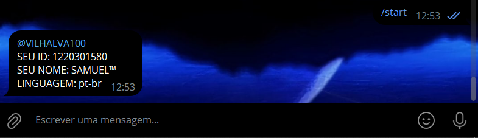
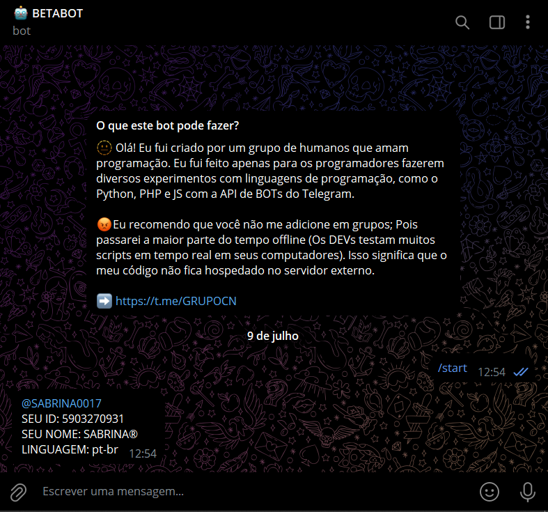
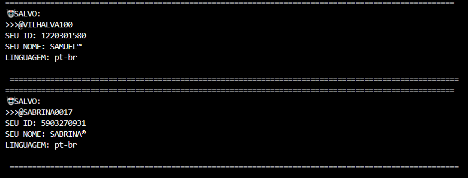
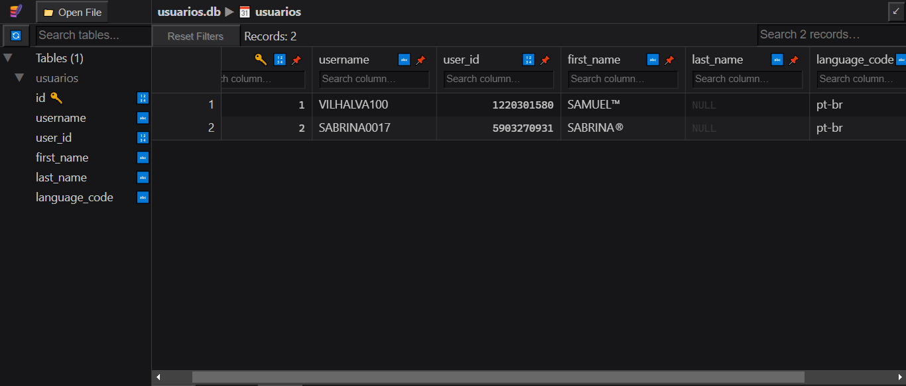

# INFO PRIVADO COM SQLITE
🧑‍💻ENCONTRE O SEU ID (E MAIS INFORMAÇÕES) COM ESSE SIMPLES BOT DO TELEGRAM E AS SALVE NO SQLITE LOCAL.

 <br>
 <br>
 <br>
 <br>

## AVISO:
Até a data de lançamento deste bot (09/07/2024), o aplicativo oficial do Telegram não oferece uma função nativa que permita aos usuários descobrir o próprio ID. Aqueles que conseguem realizar essa tarefa geralmente utilizam clientes personalizados do Telegram que disponibilizam tal recurso ou contam com a assistência de bots especializados. Foi com o intuito de preencher essa lacuna que desenvolvi a minha própria versão simplificada desse recurso. Mesmo que o Telegram venha a incorporar essa funcionalidade em futuras atualizações, manterei este bot ativo aqui no [GITHUB](https://github.com/VILHALVA?tab=repositories&q=+topic:BOT) como uma alternativa prática e acessível.

## DESCRIÇÃO:
Este bot Telegram responde ao comando "/start" fornecendo informações detalhadas sobre o usuário que iniciou a conversa. As informações são exibidas no console e também são armazenadas localmente em um banco de dados SQLite.

## FUNCIONALIDADES:
- Este bot Telegram utiliza a API de Bots do Telegram para interagir com usuários.
- Ao iniciar, o bot verifica continuamente por novas mensagens utilizando o método `getUpdates` da API.
- Quando um usuário envia o comando `/start`, o bot responde com informações básicas do usuário, como username, ID, nome, sobrenome (se disponível) e código de linguagem.
- As informações do usuário são salvas em um banco de dados SQLite (`usuarios.db`), criado automaticamente no mesmo diretório onde o código está sendo executado.
- O bot utiliza a biblioteca `requests` para fazer requisições HTTP à API do Telegram e a biblioteca `sqlite3` para interagir com o banco de dados SQLite.

## EXECUTANDO O PROJETO:
1. **Coloque o Token:**
   - Antes de executar o programa, é necessário substituir o token do seu bot no arquivo `TOKEN.py`, o qual pode ser obtido por meio do [@BotFather](https://t.me/BotFather).

2. **Instalando as dependências:**
   - Antes de executar o bot, certifique-se de instalar todas as dependências necessárias. No terminal, execute o seguinte comando para instalar as dependências listadas no arquivo `requirements.txt` em `CODIGO`:
   ```bash
   pip install -r requirements.txt
   ```

3. **Inicie o Bot:**
   - Execute o bot do Telegram em Python iniciando-o com o seguinte comando:
   ```bash
   python CODIGO.py
   ```
   
   - O bot começará a ouvir por mensagens na API de Bots do Telegram.
   - Quando um usuário enviar o comando `/start`, o bot responderá com as informações do usuário e salvará essas informações no banco de dados SQLite.

4. **Funcionamento:**
   - O método `Iniciar` do bot entra em um loop infinito para verificar por novas mensagens.
   - Ao receber uma nova mensagem, o bot verifica se é o comando `/start`.
   - Se for o comando `/start`, o bot gera uma resposta com informações do usuário e salva essas informações no banco de dados SQLite usando o método `salvar_usuario`.
   - A resposta é enviada de volta ao usuário utilizando o método `responder`.

## NÃO SABE?
- Entendemos que para manipular arquivos em muitas linguagens e tecnologias relacionadas, é necessário possuir conhecimento nessas áreas. Para auxiliar nesse aprendizado, oferecemos alguns subsidios:
* [VEJA A DOCUMENTAÇÃO](https://core.telegram.org/bots/api)
* [CURSO DE PYTHON](https://github.com/VILHALVA/CURSO-DE-PYTHON)
* [CURSO DE SQLITE](https://github.com/VILHALVA/CURSO-DE-SQLITE)
* [CURSO DE PYTHON COM SQLITE](https://github.com/VILHALVA/CURSO-DE-PYTHON-COM-SQLITE)
* [CURSO SUGERIDO](https://github.com/VILHALVA/CURSO-DE-TELEBOT)
* [CONFIRA MAIS CURSOS](https://github.com/VILHALVA?tab=repositories&q=+topic:CURSO)

## CREDITOS:
- [PROJETO BASEADO "INFO PRIVADO BOT"](https://github.com/VILHALVA/INFO-PRIVADO-BOT)
- [PROJETO FEITO PELO VILHALVA](https://github.com/VILHALVA)
